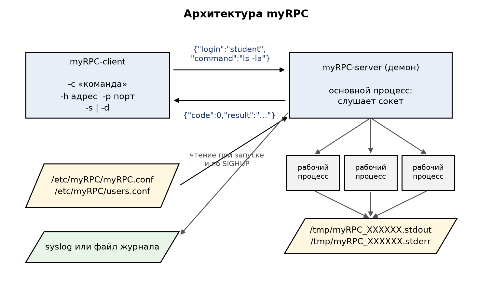
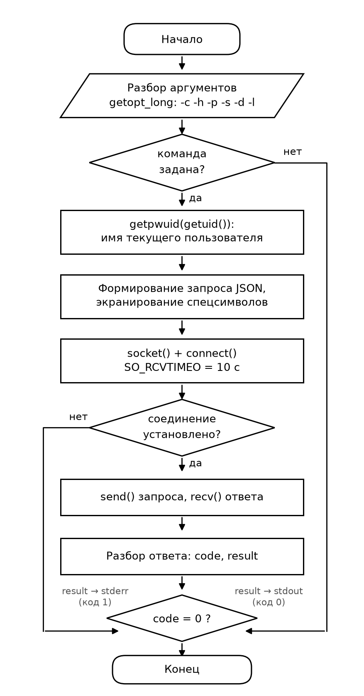
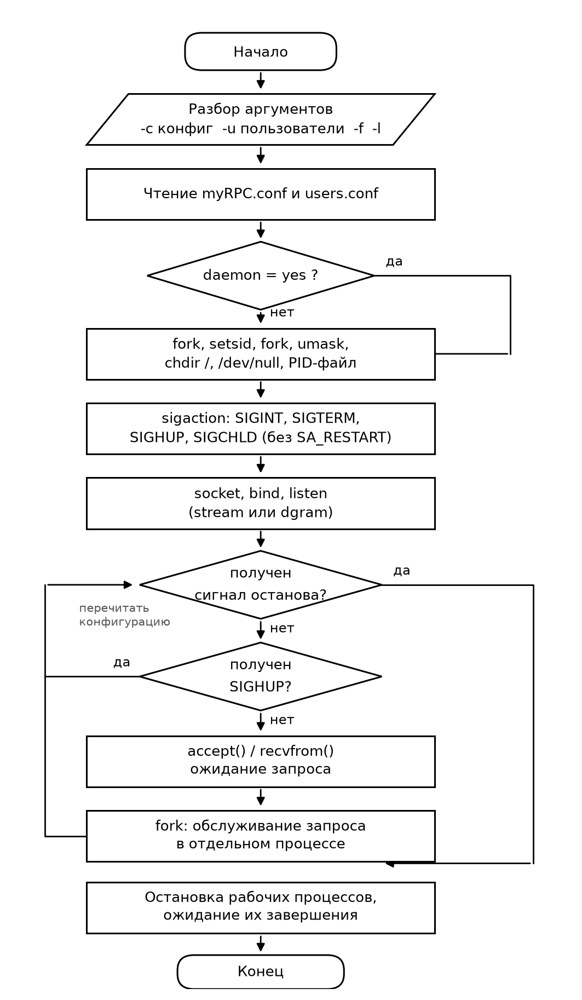
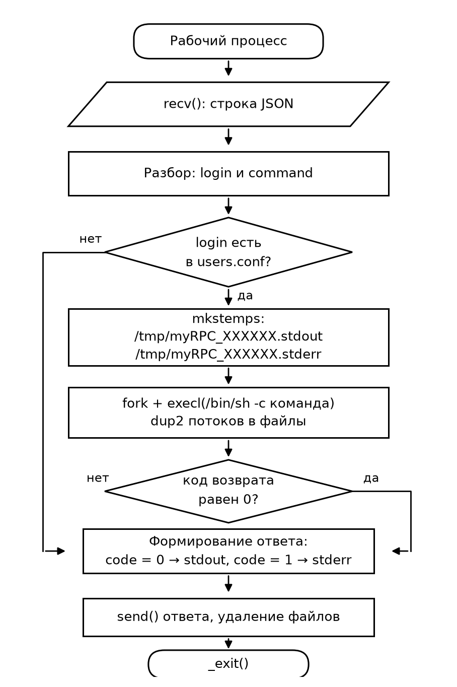

# Методология разработки подпроекта myRPC

Документ описывает принятый порядок разработки, отладки и проверки
программ `myRPC-client` и `myRPC-server`.

## 1. Общая схема



Система состоит из двух программ и трёх групп файлов:

| Элемент | Назначение |
|---|---|
| `myRPC-client` | консольная утилита, отправляет команду и печатает ответ |
| `myRPC-server` | демон, проверяет пользователя и выполняет команду |
| `/etc/myRPC/myRPC.conf` | порт, тип сокета, режим запуска |
| `/etc/myRPC/users.conf` | список допущенных пользователей |
| `/tmp/myRPC_XXXXXX.*` | временные файлы вывода выполняемой команды |

## 2. Этапы разработки

Разработка велась по модели Git Flow: каждая законченная функциональность
создавалась в отдельной ветви `feature/*`, вливалась в `develop` слиянием
без перемотки (`--no-ff`), релиз готовился в ветви `release/*` и помечался
тегом в `master`.

| Этап | Ветвь | Результат |
|---|---|---|
| 1. Каркас проекта | `feature/project-skeleton` | структура каталогов, `.gitignore`, описание в Markdown |
| 2. Общий код | `feature/common-library` | журналирование (syslog или файл), разбор конфигурации, список пользователей |
| 3. Протокол | `feature/json-protocol` | сборка и разбор JSON, экранирование специальных символов |
| 4. Клиент | `feature/client` | разбор аргументов `getopt_long`, сокеты, вывод ответа |
| 5. Сервер | `feature/server-daemon` | демонизация, сигналы, обслуживание запросов в отдельных процессах |
| 6. Сборка и пакеты | `feature/build-and-packaging` | Makefile с целями `all`, `clean`, `deb`, юнит systemd, deb-пакеты |
| 7. Тесты и конвейер | `feature/tests-and-ci` | модульные и интеграционные тесты, GitHub Actions и GitLab CI |
| 8. Документация | `feature/documentation` | описания модулей, диаграммы, настоящий документ |
| 9. Релиз | `release/1.0.0` | версия 1.0.0, тег `v1.0.0` в `master` |

Порядок был выбран так, чтобы каждая следующая ветвь опиралась на уже
проверенный код: сначала общие функции, которые легко покрыть модульными
тестами, затем клиент (он проще), затем демон, и только после этого —
упаковка и конвейер.

## 3. Алгоритмы программ

### Клиент



### Сервер



### Рабочий процесс



## 4. Отладка

Применялись следующие приёмы.

1. **Запуск демона в консоли.** Ключи `-f` (не уходить в фон) и
   `-l файл` (журнал в файл) позволяют наблюдать работу сервера
   непосредственно в терминале:

   ```sh
   ./server/myRPC-server -c /tmp/myRPC.conf -u /tmp/users.conf -f -l /tmp/s.log
   ```

2. **Подробный журнал.** Каждое существенное событие (загрузка
   конфигурации, число допущенных пользователей, открытие сокета, приём
   запроса, имена временных файлов, завершение рабочего процесса, приём
   сигнала) записывается в журнал, поэтому поведение восстанавливается по
   одному файлу.

3. **Сборка с диагностикой компилятора.** Обязательные ключи
   `-Wall -Wextra -Werror` — любое предупреждение останавливает сборку.

4. **Проверка сокетов сторонними средствами.** Работу протокола можно
   проверить без клиента:

   ```sh
   printf '{"login":"student","command":"id"}' | nc 127.0.0.1 1234
   ```

5. **Наблюдение за процессами и сигналами.**

   ```sh
   pgrep -a myRPC-server        # основной процесс и рабочие процессы
   kill -HUP $(cat /run/myRPC-server.pid)
   strace -f -p $(cat /run/myRPC-server.pid)
   ```

6. **Поиск утечек памяти.**

   ```sh
   valgrind --leak-check=full ./client/myRPC-client -c "id" -h 127.0.0.1
   ```

## 5. Найденные при отладке ошибки

Перечень приведён как результат этапа отладки; все ошибки исправлены.

| Ошибка | Проявление | Причина | Исправление |
|---|---|---|---|
| Конфигурация применялась с задержкой | после `SIGHUP` первый же запрос обрабатывался по старому списку пользователей | обработчики устанавливались с флагом `SA_RESTART`, поэтому `accept` не прерывался сигналом | флаг убран, прерванный вызов возвращает `EINTR`, и главный цикл применяет новую конфигурацию немедленно |
| Тип сокета не переключался | после изменения `socket_type` и `SIGHUP` сервер переставал отвечать | тип транспорта выбирался один раз при запуске, циклы `stream` и `dgram` были разными функциями | циклы объединены, транспорт проверяется на каждой итерации |
| Остановка демона убивала оболочку | при запуске в консоли `SIGTERM` завершал и родительский shell | завершение выполнялось вызовом `kill (0, SIGTERM)`, то есть сигнал получала вся группа процессов | заведён список идентификаторов рабочих процессов, сигнал получают только они |
| Ошибка сборки тестов | `implicit declaration of function 'unlink'` | не подключён заголовок `<unistd.h>` | заголовок добавлен |

## 6. Тестирование

Тесты разделены на два уровня и запускаются одной командой `make test`.

**Модульные тесты** (`tests/test_proto.c`, 28 проверок) — протокол и
разбор конфигурации без сети:

* запрос и ответ переживают кодирование и декодирование без изменений;
* кавычки, обратные косые черты, переводы строк и табуляции экранируются;
* повреждённые сообщения отвергаются, а не приводят к аварии;
* конфигурация читается по примеру из задания, комментарии игнорируются;
* список допущенных пользователей читается, пробелы отбрасываются,
  посторонний пользователь не распознаётся как допущенный.

**Интеграционный тест** (`tests/run_integration.sh`, 14 проверок) —
настоящий обмен по сокету:

1. сервер принимает подключения на заданном порту;
2. допущенный пользователь выполняет команду и получает её вывод;
3. неуспешная команда возвращает ненулевой код;
4. описание ошибки доходит до клиента;
5. специальные символы передаются без искажений;
6. вывод собирается во временных файлах `/tmp/myRPC_XXXXXX.stdout`;
7. пользователь вне списка получает отказ;
8. клиенту сообщается причина отказа;
9. приём `SIGHUP` фиксируется в журнале;
10. работает датаграммный транспорт;
11. долгая команда занимает рабочий процесс;
12. при остановке демон сначала завершает рабочие процессы;
13. демон дожидается завершения каждого из них;
14. демон корректно записывает факт остановки.

## 7. Непрерывная интеграция

Конвейер описан в двух вариантах: `.github/workflows/ci.yml` (GitHub
Actions) и `.gitlab-ci.yml` (GitLab CI для внутреннего стенда). Этапы:

1. **Сборка** — `make all` с `-Werror`.
2. **Модульные тесты** — `tests/test_proto`.
3. **Интеграционный тест** — `tests/run_integration.sh`.
4. **Пакеты** — `make deb`, содержимое пакетов выводится в журнал сборки.
5. **Проверка установки** — пакеты ставятся `dpkg -i`, проверяется наличие
   файлов и работоспособность `--help`.
6. **Выкладка на стенд** (GitLab, вручную) — копирование пакетов в
   репозиторий Astra Linux и обновление индекса `Packages.gz`.

Конвейер запускается на ветвях `master`, `develop`, `feature/**` и
`release/**`, поэтому нерабочий код не попадает в `develop`.

## 8. Развёртывание стенда

Стенд — две машины Astra Linux в одной виртуальной сети.

```
┌────────────────────────┐        ┌────────────────────────┐
│  astra-client          │        │  astra-server          │
│  192.168.56.10         │ ─────► │  192.168.56.11         │
│  пакет myrpc-client    │  1234  │  пакет myrpc-server    │
└────────────────────────┘        └────────────────────────┘
```

Порядок развёртывания:

```sh
# 1. Собрать пакеты
make deb

# 2. Создать репозиторий пакетов
mkdir -p ~/myrepo && cp build/*.deb ~/myrepo/
cd ~/myrepo && dpkg-scanpackages . /dev/null > Packages && gzip -9c Packages > Packages.gz

# 3. Подключить репозиторий на обеих машинах
echo "deb [trusted=yes] file:/home/user/myrepo ./" | sudo tee /etc/apt/sources.list.d/myrpc.list
sudo apt update

# 4. Установить пакеты
sudo apt install myrpc-client     # на клиентской машине
sudo apt install myrpc-server     # на серверной машине

# 5. Настроить сервер
echo student | sudo tee -a /etc/myRPC/users.conf
sudo systemctl enable --now myRPC-server
systemctl status myRPC-server

# 6. Проверить с клиентской машины
myRPC-client -h 192.168.56.11 -p 1234 -s -c "hostname"
myRPC-client -h 192.168.56.11 -p 1234 -s -c "cat /etc/astra_version"
```

Проверка отказа: выполнить ту же команду от пользователя, которого нет в
`/etc/myRPC/users.conf` — клиент напечатает `user is not allowed to run
commands` и завершится с кодом 1, а в журнале сервера появится
предупреждение с именем этого пользователя.
